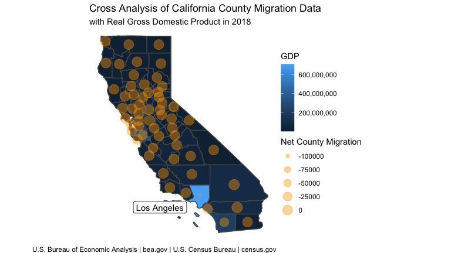

A Map of California with Census and GDP D ata
================

Note: Collaborative work with Margo Weber.

## Code

An example of mapdeck code.

``` r
get_flowCA <- get_flows(
  geography = "county",
  state = "CA",
  county = "Los Angeles County",
  geometry = TRUE,
  year = 2018) %>%  
  filter(variable == "MOVEDOUT") %>%
  na.omit() %>% 
  slice_max(estimate, n = 25) %>%
  mutate(weight = (estimate/2000),
         info = paste0(scales::comma(estimate) , 
                        " people moved from LA County to " , str_remove(FULL2_NAME, "county") , " in 2018"))
```

# Static map of California counties net migration and GDP

This choropleth map depicts the counties in the state of California.
Each county is shaded according to the GDP of the county in 2018. Most
of the state falls into the lower third of the GDP range depicted in the
key, with a GDP less than or around $300,000,000. The other information
layered onto the map is depicted in the transparent dots located in each
county which display the net migration for that county in 2018. It is
interesting to note that the net migration for most counties in the
state was close to zero, with the highly notable exception of Los
Angeles county. Los Angeles county experienced a very low net migration;
many more people left the county than moved in. The GDP likely has to do
with the high economic value of the entertainment industry located in
LA, and the migration is possibly due to the high cost of housing and
living in the county, which is 43% higher than the national average.[1]

For this map, the geographical data, including the counties, was taken
from the tidycensus package. The GDP data was taken from the BEA.[2]

<!-- -->

[1] <https://www.payscale.com/cost-of-living-calculator/California-Los-Angeles>

[2] U.S. Bureau of Economic Analysis \| bea.gov \| U.S. Census Bureau \|
census.gov
